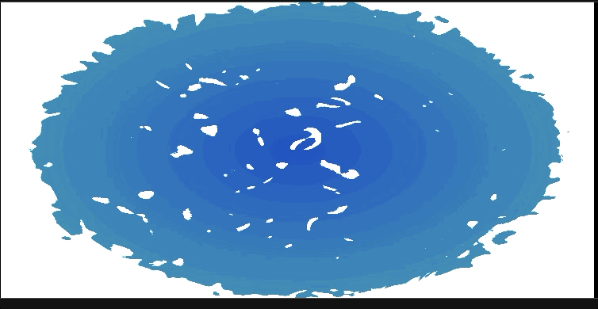
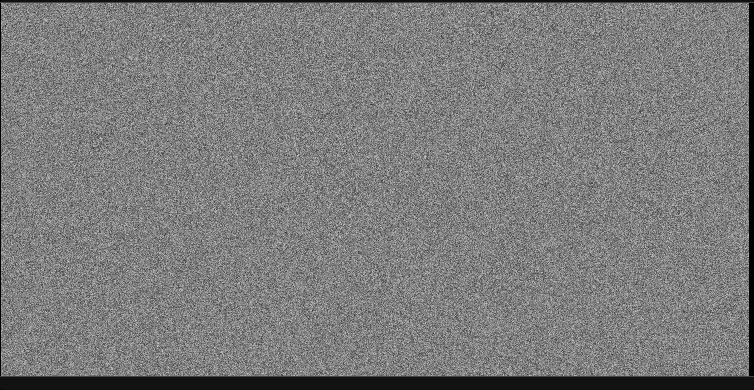
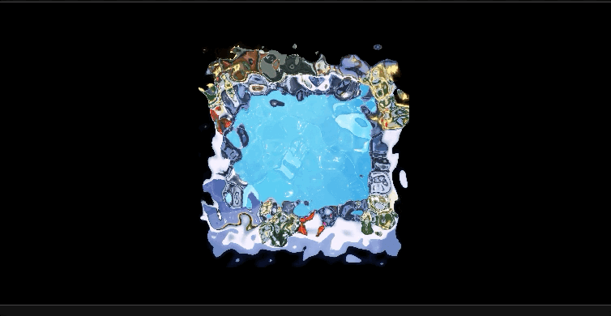
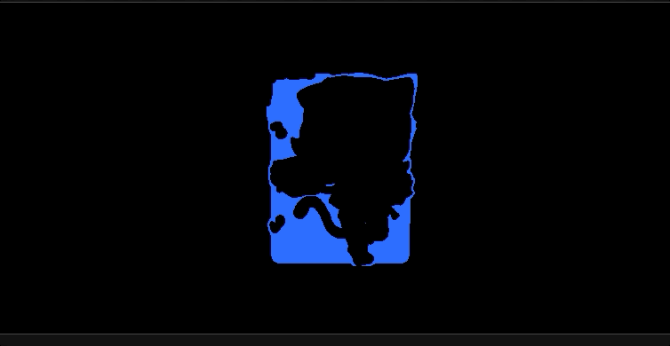
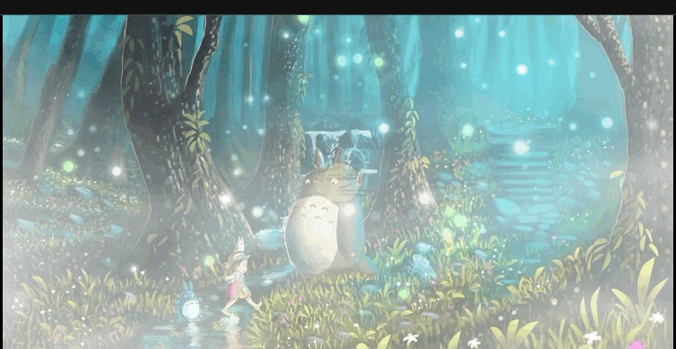

### 效果展示

#### 1. 雨幕

#### 2. 卡通水面

#### 3. 镂空描边

#### 4. 抖动描边

#### 5. 电视白噪

#### 6. 水面扭曲

#### 6. 消融

#### 7. SDF形变

#### 8. 雾气

#### 9. 文字与图片合并渲染批次

> 图中FPS的显示单独一个Drawcall, 剩下的Cocos图标和按钮一个Drawcall(分属不同图集). 引擎部分的修改参见[git-patch-engine](preview/engine.patch), [git-patch-cocos2d-x](preview/cocos2d-x.patch), [git-patch-builtin](preview/builtin.patch)